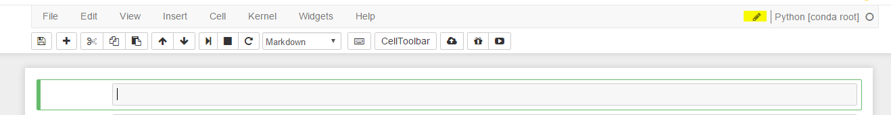
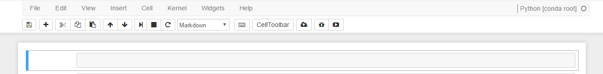
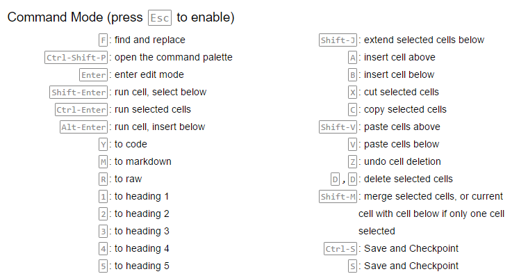
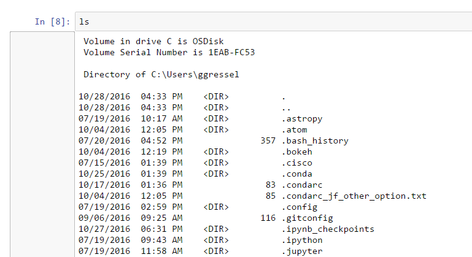
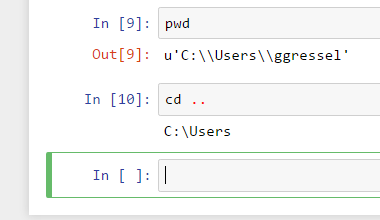
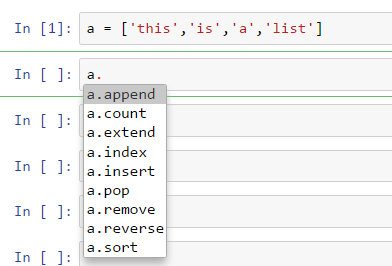
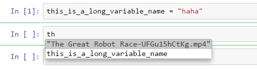

# A Guide to Jupyter Notebooks
#### [Hotkeys](https://www.cheatography.com/weidadeyue/cheat-sheets/jupyter-notebook/)
#### [Markdown Help](https://athena.brynmawr.edu/jupyter/hub/dblank/public/Jupyter%20Notebook%20Users%20Manual.ipynb)

## Cells
Every cell can be either Code or Markdown, "shift-enter" will execute the cells.
The difference between "command" mode and "edit" mode
If you look at the jupyter shortcuts, you will see something called (command).  What is that?  Whenever you are in jupyter, you are always in one of two modes.  Command mode vs Edit mode.  How can you tell the difference?

## Edit Mode - Green

## Command Mode - Blue

Command mode is always in blue around the cell.  Note the pencil is missing also.  You can get to command mode by pressing "esc"

If you look at help >> keyboard shortcuts, you will get all the shortcuts.

There are more, but... you can find them easily enough.

You can interact with your OS, as if it was a terminal session

## Tab
Autocomplete, try it out, you can use it almost everywhere.
Here we see tab giving us methods and attributes for an object.

But tab can also be used for imports

Or completing variable names that you've type out before

Note, I only typed the first two letters so there was ambiguity, hence the drop down menu for me.  But if you type enough, it will just autocomplete it.

## Shift-tab
This will show you the documentation for whatever data type are you working with.  Example:
CarND > Jupyter Notebook > image2016-10-28 15:59:40.png

If we are looking at a method, it will tell the doc string for the method.
CarND > Jupyter Notebook > image2016-10-28 16:1:28.png

This gets really useful when we starting using complicated API that has lots of inputs or parameters.
CarND > Jupyter Notebook > image2016-10-28 16:4:40.png
Oh, but I know there is more than that!  So.. let me just press shift-tab another time and it will give me more information
CarND > Jupyter Notebook > image2016-10-28 16:6:9.png

Note that the above picture has a scroll bar, which means we can scroll on that documentation!
Wait, now when I want to type in my arguments, I can't remember what they refer to.  I want the documentation to stay for me, so I can refer to it as I type in my arguments. Guess what? You guess!
Hit shift-tab three times in a row until you see the clock!  The clock will keep it popped it out even as you type
CarND > Jupyter Notebook > image2016-10-28 16:9:42.png
Sigh, still not enough?  Fine, just hit shift-tab 4 times and it will pop out at the bottom of your screen, in a semi-separate window
CarND > Jupyter Notebook > image2016-10-28 16:10:57.png
I've highlighted the controls for this pop out.  You can raise and lower it by dragging on the middle button.  You can close the window or pop it out with the controls in the upper right corner.

Something Totally Crazy – Copy Pasting Code Examples
So you are reading some documentation, and want to follow along with their example. Like this one.
CarND > Jupyter Notebook > image2016-10-28 16:24:10.png
But you really don't wanna type out all those pandas initialization.. No problem you can literally copy paste it!
CarND > Jupyter Notebook > image2016-10-28 16:26:18.png

This doesn't always work perfectly, but generally it's worth trying.

Some magic ipython commands
So, you've been hacking at this script for awhile and you need to use some variables you iniatilized awhile ago, but you can't remember what it's called.  Sick of scrolling up?
CarND > Jupyter Notebook > image2016-10-28 16:28:17.png
Note:  `whos` only works when it's the only command in the cell block.
You can also add modifiers to Whos.  Here I search for DataFrames only.
CarND > Jupyter Notebook > image2016-11-4 14:1:42.png
A Useful Trick to Hide Memory Locations
